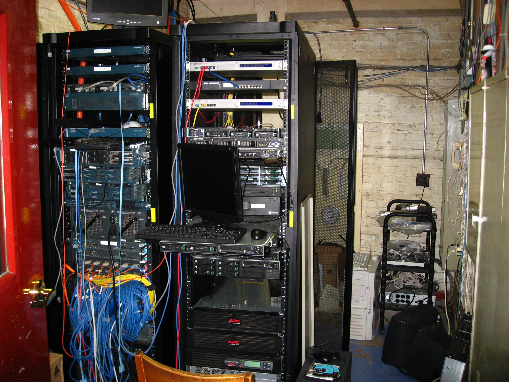
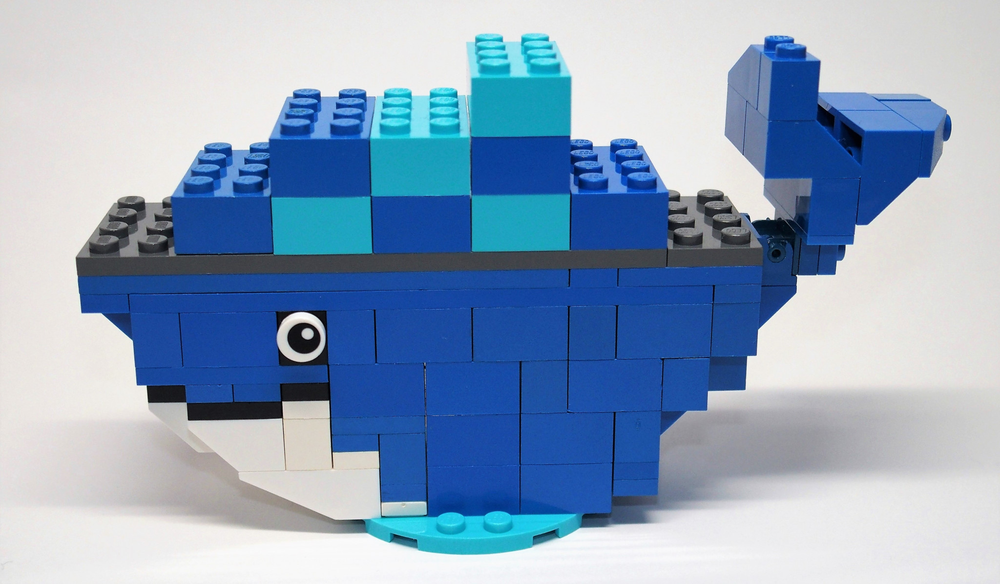
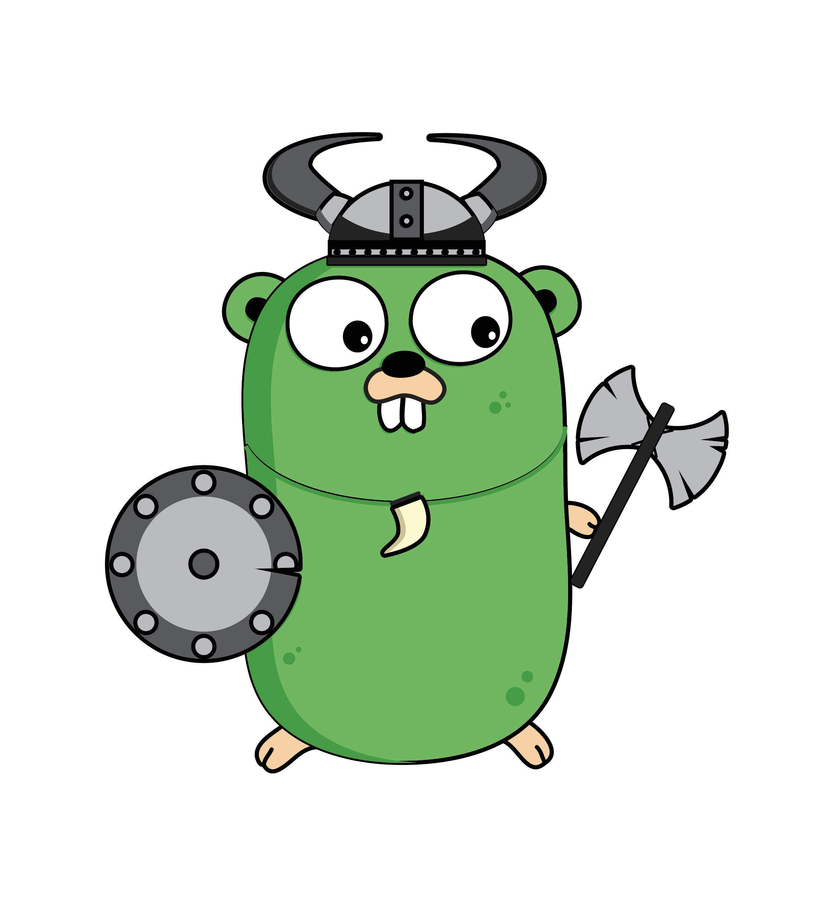
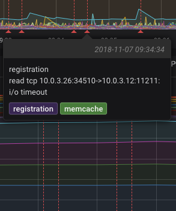

build-lists: true
theme: Next, 1
autoscale: true

[.footer: #### Igor Karpovich]

## Go, Swarm and DevOps
### vs
## The Mighty Monolith

---

# Disclaimer

## Not a true story at all
## All persons and events are fictitious
## No gophers were harmed

---

# 2013:

- Secure in-house infrastructure
- Cloud for customer facing products
- Monitoring by looking into server rooms
- F&G log analysis system (F for *find* and G for *grep*)
- Jenkins for tests, *manual* deployments
- 4 products

---

# 2018

- Multi cluster AWS environment
- Container orchestration for *all* products
- Logging, monitoring, tracing
- CI/CD for products and infrastructure
- 50+ products

---

# It's been a long road...

- Culture
- Architecture
- Platform
- Legacy

^ Had to maintain and improve business projects and incident support.
Deployments were automated by the beginning of 2015.
First microservice launched in July 2015.
Docker for CI launched in March 2016.

<!--
Full timeline:
Core product started October 2009
--- First micro service started July 2015
Swarm 1.0 November 3 2015
Helm February 23 2016
—- Docker launched for CI March 2016
K8s 1.2 March 16 2016
—- legacy swarm live June 2016
K8s 1.3 July 1 2016
Minikube July 11 2016
Swarm Mode July 28 2016
Kops September 8 2016
K8s 1.4 September 26 2016
—- swarm live December 2016
​
-->

---

# Moving away from CDD[^*]

[^*]: Chaos Driven Development

- No more favourite IT people to go to
- Ticketing system
- Change management and deployment awareness
- Feedback loop
- Incident management
- Iterative approach with steady value delivery

^ (External culture)
Reducing WIP by stopping upstream
Upstream & Downstream
Kanban & Scrum

---

# DevOps :heart: Docker

- Infrastructure as code
- Unified environments
- No more "works on my machine"
- Easy debugging

^ (Internal culture)

---

# DevOps is *not*:

- A job title
- Ops telling Dev to DIY
- Giving out unlimited access to production

---

# Version Zero
## First microservice

- HTTP API only
- Monitoring coverage
- Plugged into core app
- Traditional deployment
- Written in PHP

---

# On the way to the bright future

- Maintaining stability
- Security by design
- Increasing velocity
- Supporting innovation

---

# Honouring legacy

- Minimising incidents
- Shutdown planning for software and infrastructure
- Replacing monolith pieces with microservices calls

---

# Swarm?

Out of the box (*2016*):

- Service discovery
- Networking, i.e. mesh routing
- Volumes (EBS/EFS in AWS)
- Orchestration with Compose
- Quick start, less maintenance

^Missing:
- Scheduler
- Job runner
- Configs, secrets (*2016*)

---

# Goblin

## Microservice framework

---

## Some of Goblin's features

- Runtime (module) management
- Config management
- Storage & Cache
- REST Client
- WebSocket router
- Monitoring metrics (Gin, WS router, go runtime)
- Logging (context data injection, sentry integration)
- Healthchecks
- Tracing

^ Mention SDK

---

# Healthchecks as metrics

- Docker native support
- Expose metrics
- Push to InfluxDB
- Visualisation

---

# Distributed tracing
## Trace everything!
- HTTP/WS Server
- HTTP Client
- SQL
- NoSQL
- MQ
- Events

---

# Platform toolkit

- Multi cluster self-deployment, i.e. edge router (traefik), CI, monitoring, logging
- Secret management
- Service wide event broadcast
- SSO, identity management (ACL, JWT, SAML)
- Scheduler
- Job runner
- Change Audit
- Multi-route email delivery
- Monitoring (InfluxDB, Grafana, Slack, TV dashboards)

---

# Palantir
## Monitoring backend and TV Dashboard featuring visual Swarm

- Pulls metrics from InfluxDB
- Metric format is Telegraf compatible
- YAML definition for Docker Stacks
- Metric templates with YAML anchors

---

# Questions!

[.footer: #### Twitter: @ikarpovich]
